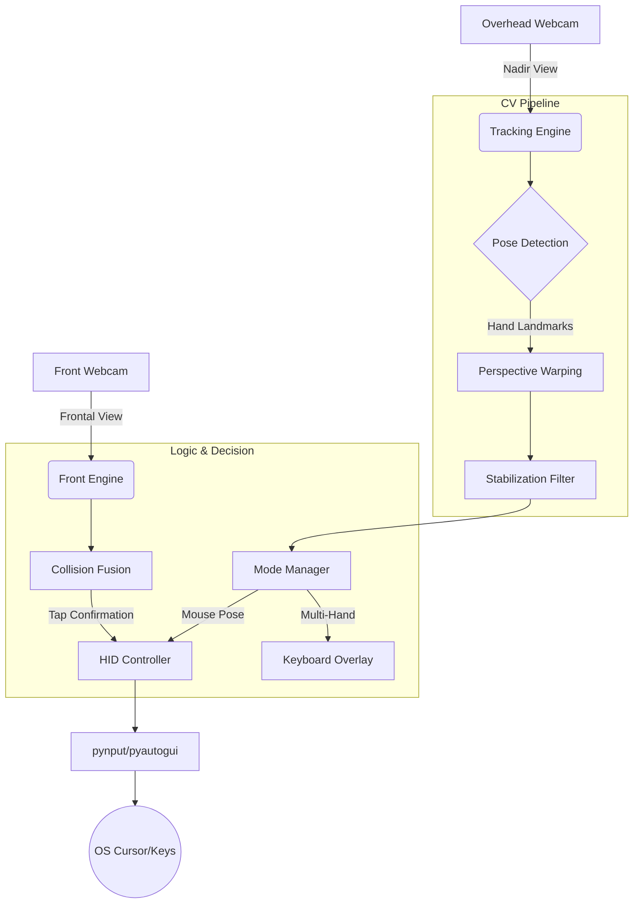

# VISION-AIR (Virtual Spatial Interface)

[](https://www.python.org/downloads/)
[](https://opensource.org/licenses/MIT)
[](https://opencv.org/)

**VISION-AIR** transforms any flat surface (like a desk) into a high-precision, multi-functional spatial input device using only a standard overhead webcam. By combining advanced Computer Vision and depth-estimation heuristics, it enables a "keyboard-less" and "mouse-less" workspace.

---

## 🚀 Key Features

*   **Invisible UI Overlay**: Automatically switches between keyboard and gesture mouse modes based on hand pose.
*   **Perspective Correction**: Homography-based mapping ensures linear movement on the desk translates perfectly to the screen.
*   **Dual-Camera Fusion (Experimental)**: Uses a front-facing camera to confirm physical contact via a "floor-line" verification system.
*   **Delta-Z Collision**: A velocity-based depth detection algorithm for virtual taps and clicks.
*   **One-Euro Filter**: Provides jitter-free, fluid cursor movement for professional precision.
*   **Multi-Finger Support**: Contextual actions based on finger count and relative positions.

---

## 🏗 System Architecture



---

## 📦 Installation

1.  **Clone the repository**:
    ```bash
    git clone https://github.com/chaitanya-369/VISION-AIR.git
    cd VISION-AIR
    ```

2.  **Set up a virtual environment**:
    ```bash
    python -m venv .venv
    source .venv/bin/activate  # On Windows: .venv\Scripts\activate
    ```

3.  **Install dependencies**:
    ```bash
    pip install .
    ```
    *Note: If `pip install .` fails, use `pip install -r requirements.txt`.*

---

## 🛠 Usage

### 1. Calibration (Crucial)
Before the first run, you must calibrate the desk surface:
```bash
python scripts/calibrate.py
```
*Follow the on-screen instructions to click the 4 corners of your desk area.*

### 2. Launch the System
```bash
python -m vision_air.main
```

### 3. Controls
*   `Q`: Quit
*   `H`: Toggle HID output (Safety switch)
*   `V`: Toggle Landmark Preview
*   `C`: Toggle Raw/Corrected Camera View
*   `T/X/Y`: Adjust Axis Mapping

---

## 📂 Project Structure

```text
VISION-AIR/
├── assets/models/      # AI Models (hand_landmarker.task)
├── docs/               # Technical Documentation
├── src/vision_air/     # Core Source Code
│   ├── core/           # Tracking & Logic Engines
│   ├── input/          # OS Integration (HID)
│   ├── ui/             # PyQt5 Overlay HUD
│   └── utils/          # Config & Downloader
├── pyproject.toml      # Build Configuration
└── requirements.txt    # Dependency List
```

---

## 📄 Documentation

For more detailed information, please refer to:
*   [Architecture Design](docs/ARCHITECTURE.md)
*   [Calibration Guide](docs/CALIBRATION_GUIDE.md)

---

## 🤝 Contributing

Contributions are welcome! Please open an issue or submit a pull request for any improvements or bug fixes.

---

## 📜 License

Distributed under the MIT License. See `LICENSE` for more information.
